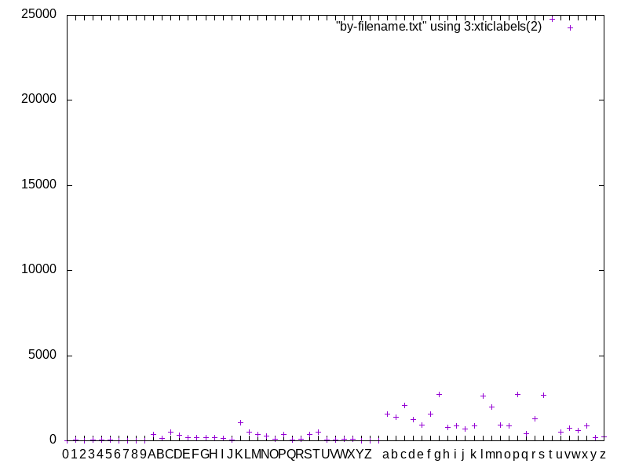
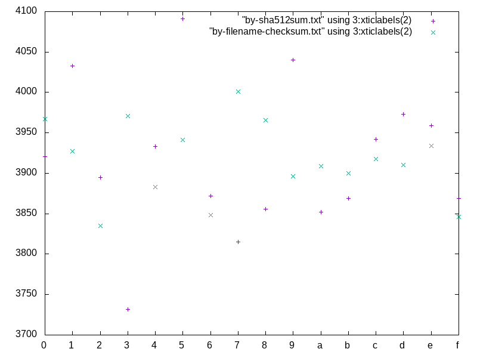
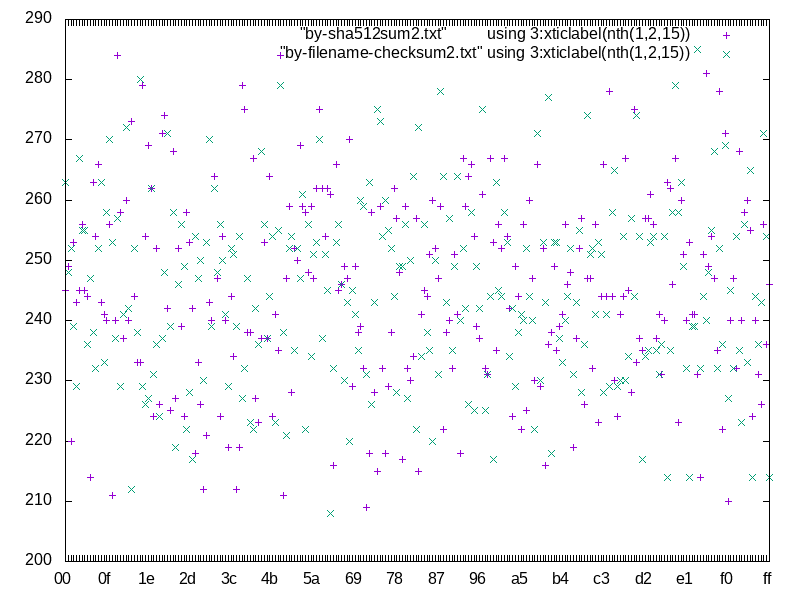

Abstract
========
This GLEP describes the procedure for splitting the distfiles on mirrors
into multiple directories with the goal of reducing the number of files
in a single directory.

Motivation
==========
At the moment, both the package manager and Gentoo mirrors use flat
directory structure to store files.  While this solution usually works,
it does not scale well.  Directories with large number of files usually
have significant performance penalty, unless using filesystems
specifically designed for that purpose.

According to the Gentoo repository state at 2018-01-26 16:23, there
was a total of 62652 unique distfiles in the repository.  While
the users realistically hit around 10% of that, distfile mirrors often
hold even more files --- more so if old distfiles are not wiped
immediately.

While all filesystems used on Linux boxes should be able to cope with
a number that large, they may suffer a performance penalty with even
a few thousand files.  Additionally, if mirrors enable directory indexes
then generating the index imposes both a significant server overhead
and a significant data transfer.  At this moment, the index
of distfiles.gentoo.org has around 17 MiB.

Splitting the distfiles into multiple directories makes it possible
to avoid those problems by reducing the number of files in a single
directory.  For example, splitting the forementioned set of distfiles
into 16 directories that are roughly balanced allows to reduce
the number of files in a single directory to around 4000.  Splitting
them further into 256 directories (16x16) results in 200-300 files
per directory which should avoid any performance problems long-term,
even assuming 300% growth of number of distfiles.

Specification
=============
Mirror layout file
------------------
A mirror adhering to this specification should include a ``layout.conf``
file in the top distfile directory.  This file uses the format
derived from the freedesktop Desktop Entry Specification file format
[#DESKTOP_FORMAT]_.

Before using each Gentoo mirror, the package manager should attempt
to fetch (update) its ``layout.conf`` file and process it to determine
how to use the mirror.  If the file is not present, the package manager
should behave as if it were empty.

The package manager should recognize the sections and keys listed below.
It should ignore any unrecognized sections or keys --- the format
is intended to account for future extensions.

This specification currently defines one section: ``[structure]``.
This section defines one or more repository structure definitions
using sequential integer keys.  The definition keyed as ``0``
is the most preferred structure.  The package manager should use
the first structure format it recognizes as supported, and ignore any
it does not recognize.  If this section is not present, the package
manager should behave as if only ``flat`` structure were supported.

The following structure definitions are supported:

* ``flat`` to indicate the traditional flat structure where all
  distfiles are located in the top directory,

* ``filename-hash <algorithm> <cutoffs>`` to indicate the `filename
  hash structure`_ explained below.

Filename hash structure
-----------------------
When using the filename hash structure, the distfiles are split
into directories whose names are derived from the hash of distfile
filename.  This structure has two parameters: *algorithm name*
and *cutoffs* list.

The algorithm name must correspond to a valid Manifest hash name.
An informational list of hashes is included in GLEP 74 [#GLEP74]_,
and the policies for introducing new hashes are covered by GLEP 59
[#GLEP59]_.

The cutoffs list specifies one or more integers separated by colons
(``:``), indicating the number of bits (starting with the most
significant bit) of the hash used to form subsequent subdirectory names.
For example, the list of ``2:4`` would indicate that top-level directory
names are formed using 2 most significant bits of the hash (resulting
in 2² = 4 directories), and each of this directories would have
subdirectories formed using the next 4 bits of the hash (resulting
in 2⁴ = 8 subdirectories each).

The exact algorithm for determining the distfile location follows:

1. Let the distfile filename be **F**.

2. Compute the hash of **F** and store its binary value as **H**.

3. For each integer **C** in cutoff list:

   a. Take **C** most significant bits of **H** and store them as **V**.

   b. Convert **V** into hexadecimal integer, left padded with zeros
      to **C/4** digits (rounded up) and append it to the path, followed
      by the path separator.

   c. Shift **H** left **C** bits.

4. Finally, append **F** to the obtained path.

In particular, note that when using nested directories
the subdirectories do not repeat the hash bits used in parent directory.

Migrating mirrors to the hashed structure
-----------------------------------------
Since all distfile mirrors sync to the master Gentoo mirror, it should
be enough to perform all the needed changes on the master mirror
and wait for other mirrors to sync.  The following procedure
is recommended:

1. Include the initial ``layout.conf`` listing only ``flat`` layout.

2. Create the new structure alongside the flat structure. Wait for
   mirrors to sync.

3. Once all mirrors receive the new structure, update ``layout.conf``
   to list the ``filename-hash`` structure.

4. Once a version of Portage supporting the new structure is stable long
   enough, remove the fallback ``flat`` structure from ``layout.conf``
   and duplicate distfiles.

This implies that during the migration period the distfiles will
be stored duplicated on the mirrors and therefore will occupy twice
as much space.  Technically, this could be avoided either by using
hard links or symbolic links.

The hard link solution allows us to save space on the master mirror.
Additionally, if ``-H`` option is used by the mirrors it avoids
transferring existing files again.  However, this option is known
to be expensive and could cause significant server load.  Without it,
all mirrors need to transfer a second copy of all the existing files.

The symbolic link solution could be more reliable if we could rely
on mirrors using the ``--links`` rsync option.  Without that, symbolic
links are not transferred at all.

Using hashed structure for local distfiles
------------------------------------------
The hashed structure defined above could also be used for local distfile
storage as used by the package manager.  For this to work, the package
manager authors need to ensure that:

a. The ``${DISTDIR}`` variable in the ebuild scope points to a temporary
   directory where distfiles specific to the package are linked
   in a flat structure.

b. All tools are updated to support the nested structure.

c. The package manager provides a tool for users to easily manipulate
   distfiles, in particular to add distfiles for fetch-restricted
   packages into an appropriate subdirectory.

For extended compatibility, the package manager may support finding
distfiles in flat and nested structure simultaneously.

Rationale
=========
Algorithm for splitting distfiles
---------------------------------
In the original debate that occurred in bug #534528 [#BUG534528]_,
three possible solutions for splitting distfiles were listed:

a. using initial portion of filename,

b. using initial portion of file hash,

c. using initial portion of filename hash.

The significant advantage of the filename option was simplicity.  With
that solution, the users could easily determine the correct subdirectory
themselves.  However, it's significant disadvantage was very uneven
shuffling of data.  In particular, the TeΧ Live packages alone count
almost 23500 distfiles and all use a common prefix, making it impossible
to split them further.

The alternate option of using file hash has the advantage of having
a more balanced split.  Furthermore, since hashes are stored
in Manifests using them is zero-cost.  However, this solution has two
significant disadvantages:

1. The hash values are unknown for newly-downloaded distfiles, so
   ``repoman`` (or an equivalent tool) would have to use a temporary
   directory before locating the file in appropriate subdirectory.

2. User-provided distfiles (e.g. for fetch-restricted packages) with
   hash mismatches would be placed in the wrong subdirectory,
   potentially causing confusing errors.

Using filename hashes has proven to provide a similar balance
to using file hashes.  Furthermore, since filenames are known up front
this solution does not suffer from the both listed problems.  While
hashes need to be computed manually, hashing short string should not
cause any performance problems.

   Distribution of distfiles by first character of filenames

   Distribution of distfiles by first hex-digit of checksum
   (x --- content checksum, + --- filename checksum)

   Distribution of distfiles by two first hex-digits of checksum
   (x --- content checksum, + --- filename checksum)

Layout file
-----------
The presence of control file has been suggested in the original
discussion.  Its main purpose is to let package managers cleanly handle
the migration and detect how to correctly query the mirrors throughout
it.  Furthermore, it makes future changes easier.

The format lines specifically mean to hardcode as little about
the actual algorithm as possible.  Therefore, we can easily change
the hash used or the exact split structure without having to update
the package managers or even provide a compatibility layout.

The file is also open for future extensions to provide additional mirror
metadata.  However, no clear use for that has been determined so far.

Hash algorithm
--------------
The hash algorithm support is fully deferred to the existing code
in the package managers that is required to handle Manifests.
In particular, it is recommended to reuse one of the hashes that are
used in Manifest entries at the time.  This avoids code duplication
and reuses an existing mechanism to handle hash upgrades.

During the discussion, it has been pointed that this particular use case
does not require a cryptographically strong hash and a faster algorithm
could be used instead.  However, given the short length of hashed
strings performance is not a problem, and speed does not justify
the resulting code duplication.

It has also been pointed out that e.g. the BLAKE2 hash family provides
the ability of creating arbitrary length hashes instead of truncating
the standard-length hash.  However, not all implementations of BLAKE2
support that and relying on it could reduce portability for no apparent
gain.

Backwards Compatibility
=======================
Mirror compatibility
--------------------
The mirrored files are propagated to other mirrors as opaque directory
structure.  Therefore, there are no backwards compatibility concerns
on the mirroring side.

Backwards compatibility with existing clients is detailed
in `migrating mirrors to the hashed structure`_ section.  Backwards
compatibility with the old clients will be provided by preserving
the flat structure during the transitional period.

The new clients will fetch the ``layout.conf`` file to avoid backwards
compatibility concerns in the future.  In case of hitting an old mirror,
the package manager will default to the ``flat`` structure.

Package manager storage compatibility
-------------------------------------
The exact means of preserving backwards compatibility in package manager
storage are left to the package manager authors.  However, it is
recommended that package managers continue to support the flat layout
even if it is no longer the default.  The package manager may either
continue to read files from this location or automatically move them
to an appropriate subdirectory.

Reference Implementation
========================
TODO.

References
==========
.. [#DESKTOP_FORMAT] Desktop Entry Specification: Basic format of the file
   (https://standards.freedesktop.org/desktop-entry-spec/latest/ar01s03.html)

.. [#GLEP74] GLEP 74: Full-tree verification using Manifest files:
   Checksum algorithms (informational)
   (https://www.gentoo.org/glep/glep-0074.html#checksum-algorithms-informational)

.. [#GLEP59] GLEP 59: Manifest2 hash policies and security implications
   (https://www.gentoo.org/glep/glep-0059.html)

.. [#BUG534528] Bug 534528 - distfiles should be sorted into subdirectories
   of DISTDIR
   (https://bugs.gentoo.org/534528)

Copyright
=========
This work is licensed under the Creative Commons Attribution-ShareAlike 3.0
Unported License. To view a copy of this license, visit
http://creativecommons.org/licenses/by-sa/3.0/.
